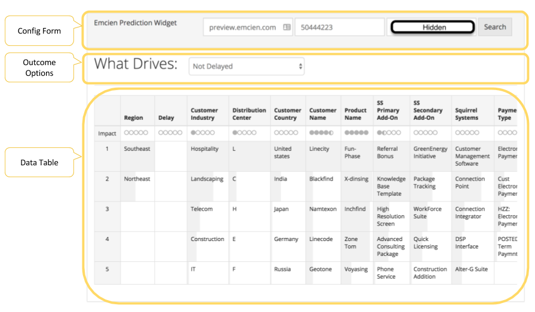

<p align="center">
  
</p>

# Emcien Prediction Widget

This is a reference implementation of a visualization based on the Emcien API. 


* [Development Setup](#development-setup)
* [Production Deployment](#production-deployment)
* [File Structure](#file-structure)
* [Solution Design](#solution-design)

## Development Setup

*Note*: There is no compilation step for this reference app. It's written entirely in plain ES5 syntax. However in order to develop locally, you may need a local web server. 

* Clone the repo
* Install npm dependencies (only used to get a local web server)
* Run `npm start`
* Open `localhost:8080`

*Note* The development server does not hot reload, so you'll have to refresh manually.

## Production Deployment
Simply upload all of the files in the `src` directory to a web host. It should just work!

## File Structure 
```
src/
├── css
│   └── style.css - Custom CSS styles
├── favicon.ico - Site Favicon
├── index.html - Default single HTML page loaded
└── js
    ├── emcienPrediction.js - Main handlers for data retrieval and UI updates
    └── lib
        ├── emcienApi.js - Helpers for API calls
        ├── emcienConfigForm.js - Helpers to manage the Config Form
        ├── emcienDataTable.js - Helpers to manage the Data Table
        └── emcienOutcomeOptions.js - Helper to manage the outcome dropdown
```

## Solution Design

*Note*: All of the JavaScript files in this application use a variation the [module pattern](https://toddmotto.com/mastering-the-module-pattern/).

*Note*: All the JavaScript functions used in this project have [JSDoc](http://usejsdoc.org/) style comments attached to them. 

This reference application can really be thought of as being composed of three parts:

<p align="center">
  
</p>

* Config Form - Submitting the Config Form queries the Outcomes API (`reports/{report_id}/outcomes`) to retrieve the outcomes for a particular report and populates the Outcome Options dropdown

* Outcome Options - Selecting a specific outcome queries the Outcomes API (`reports/{report_id/outcomes/{outcome_id}/categories`) to retrieve the categories and populates the Data Table

* Data Table - Displays the category data

Each of these parts has a corresponding helper file in the `src/lib` directory with the relevant rendering or parsing functions. Note that these files all use the module pattern, so it will be helpful to first go to the bottom of the file to check out their public methods before reading all the private methods, i.e `_privateMethod`.

For example, you'll notice that the table in the [`src/index.html`](src/index.html) is empty. To find the functions that handle rendering new data into the data table, you'd want to look in [`src/js/lib/emcienDataTable.js`](src/js/lib/emcienDataTable.js) to see how.

### User Interactions

There are only two main user interactions that we have to handle:

* Submitting the Config Form
* Selecting an Outcome Option

Both of those handlers are defined in the [`src/js/emcienPrediction.js`](src/js/emcienPrediction.js) file as `handleConfigFormSubmit` and `handleOutcomeChange` respectively. Think of these as entry points for the application as they are the only two functions that you'll see called in the [`src/index.html`](src/index.html). Both of these functions then utilize helper functions from the `src/lib` directory to make API calls, update the DOM, etc. 
